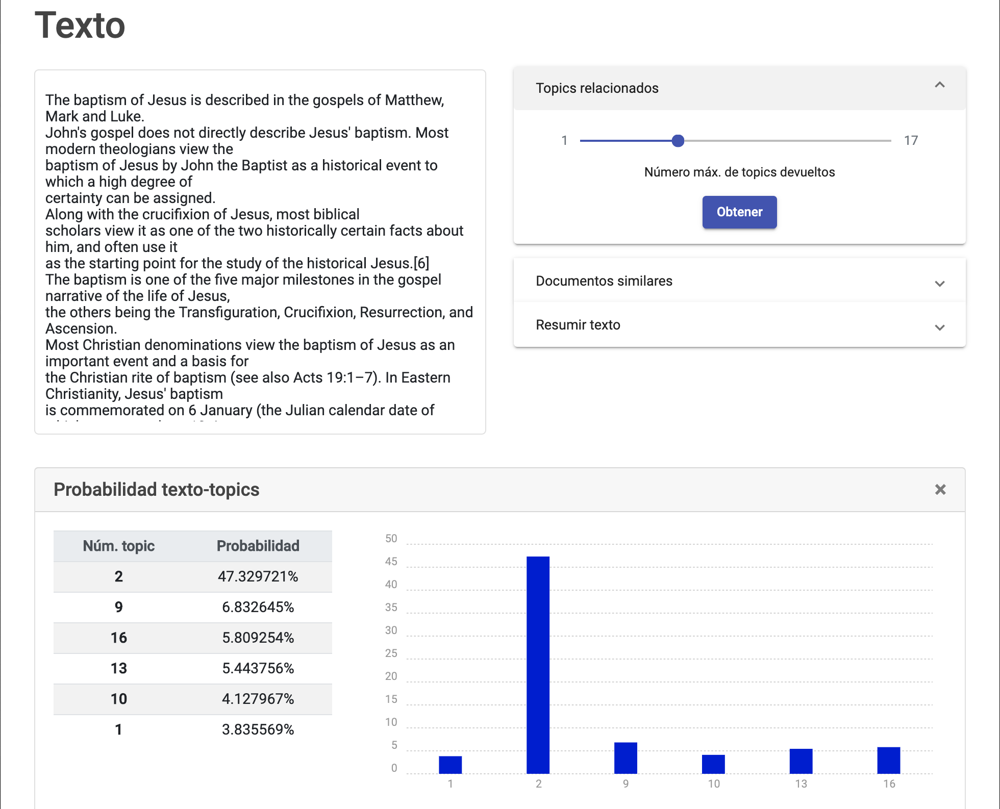
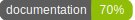

# Web Frontend

  
  

## What is it?
This project is an Angular application that represents the web frontend of my final degree project.

This application consumes the REST API served by the [web_backend](https://github.com/CarlosSanabriaM/web_backend).

## Main features
* **Uses Angular Material 7.3.7 and Bootstrap 4, and NG Bootstrap.**
* **Uses Angular Reactive Forms.**
* **Uses Chartist to create the histogram.**
* **Uses the HTML5 File API to drag and drop a text file in the textarea.**
* **Uses Compodoc for generating the documentation.**
* **After pressing a button, the page automatically scrolls to the card, and shows a loading spinner.**
* **Shows error messages in Angular Material Snack bar.**
* **It's completely adaptable, changing the layout and other small details depending on the screen size.**
* **Contains a Dockerfile to create a Docker image to execute the frontend in an isolated environment or deploy it.**

## Dependencies, Installation and Usage
All this information and more is present in the [documentation](documentation).

To generate the documentation and visualize it, follow this steps:

1. Install compodoc 1.1.8 via npm: `npm install -g @compodoc/compodoc@1.1.8`
2. Render the documentation, and serve it with compodoc: `compodoc -p tsconfig.json -s --assetsFolder images --includes additional-documentation-sources`
3. Access the HTML page in [http://127.0.0.1:8080/](http://127.0.0.1:8080/).

Compodoc 1.1.9 has a bug that fails to render source code blocks in Markdown files, 
so for the moment better install compodoc 1.1.8. 
See this [issue](https://github.com/compodoc/compodoc/issues/750) for more info.

For more info about compodoc, visit the [Compodoc Usage page](https://compodoc.app/guides/usage.html).

## Angular default info

### Development server

Run `ng serve` for a dev server. Navigate to `http://localhost:4200/`. 
The app will automatically reload if you change any of the source files.

### Code scaffolding

Run `ng generate component component-name` to generate a new component. 
You can also use `ng generate directive|pipe|service|class|guard|interface|enum|module`.

### Build

Run `ng build` to build the project. The build artifacts will be stored in the `dist/` directory. 
Use the `--prod` flag for a production build.

### Running unit tests

Run `ng test` to execute the unit tests via [Karma](https://karma-runner.github.io).

### Running end-to-end tests

Run `ng e2e` to execute the end-to-end tests via [Protractor](http://www.protractortest.org/).

### Further help

To get more help on the Angular CLI use `ng help` or go check out the 
[Angular CLI README](https://github.com/angular/angular-cli/blob/master/README.md).
